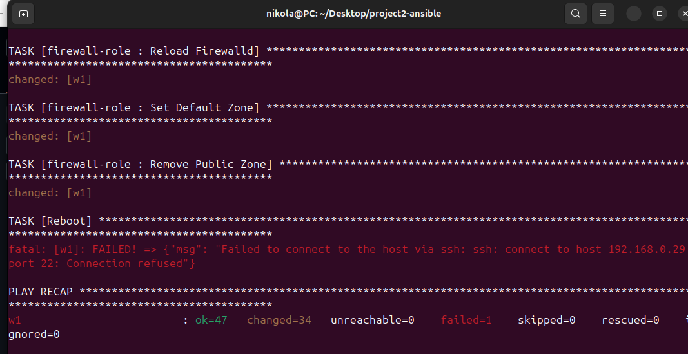
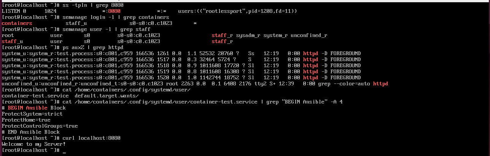

In this project I've tried to isolate and secure container as much as I can.
Project creates custom container user with no shell ( /sbin/nologin ) and no sudo privileges.
User is mapped to staff_u SeLinux user which has only one role staff_r ( system_r and other roles are removed ).
Using udica I've created custom SeLinux label which container is using.
Container is running in non root enviroment using podman and starts automatically from user systemd file.
Systemd file and Sysctl file have custom parametars which make it more secure and isolated.

For this project you need to have one redhat virtual machine with subscription-manager registred.
And one more machine which exports NFS dir -> nfs-dir/html/index.html ( You can skip this part but you have to comment out nfs-role in playbooks/main.yaml )
Also comment out task located in container-role - name: Modify unit file label 2 

Step 1.
Create python3 enviroment which has ansible-navigator and ansible-builder installed.
Build execution enviroment image from ansible-ee/execution-environment.yaml file using ansible-builder.
In ansible-navigator.yaml file change the name of image to name which you selected.
In invontory/hosts file set the ip address of your virtual machine

Step 2.
You can modify variables located in playbooks/vars/main.yaml.
Required variables which you need to populate are podman_username,podman_password,nfs_ip.

Step 3.
Run playbooks/main.yaml file using ansible-navigator

When ansible finishes you will only be able to login using user specified in playbooks/vars/main.yaml using key project2-key.
I've had some problems with podman_container module which didnt let me mount custom dirs to containers so I had to manually add line into systemd file.

Sysctl
Seboolean
